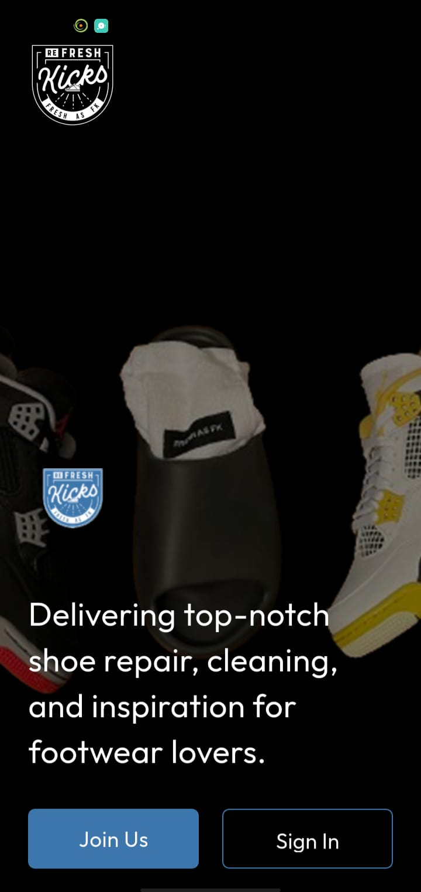
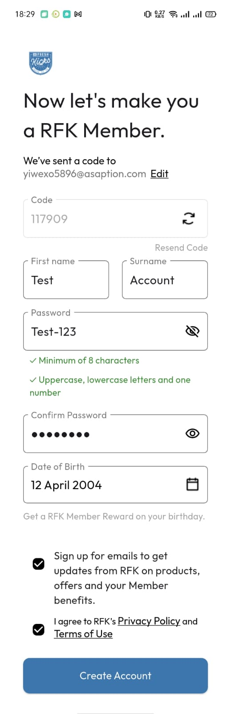
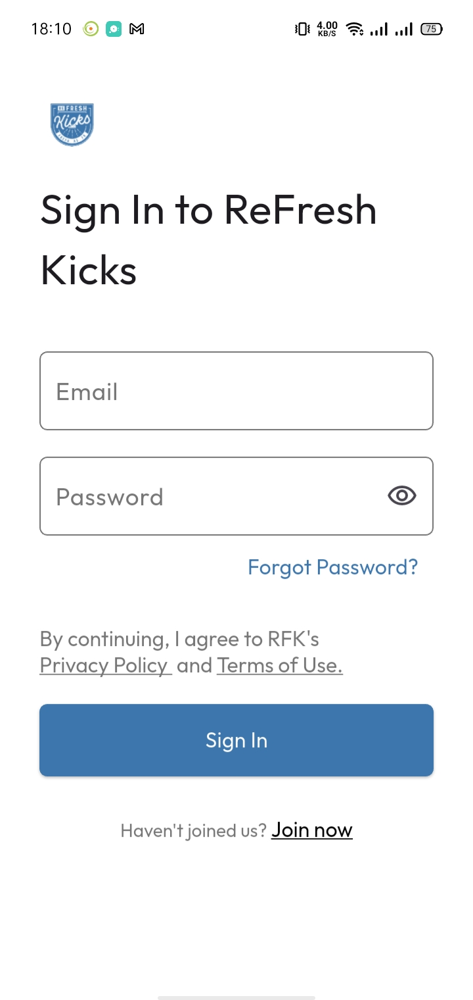
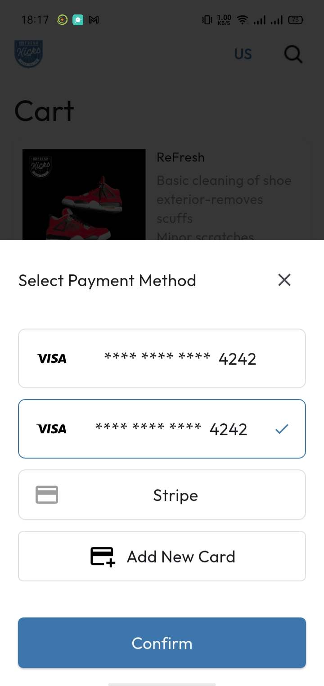

# RefreshKicks Mobile App

User App for RefreshKicks (A shoe cleaning service)

It includes: 
- Splash Screen
- Authentication (Login/SignUp/OTP Verification/Forget Password etc)
- Onboarding 
- Home Screen
- Shop
- Service Rating & Reviews
- Cart System
- Checkout
- User Profile
  
#### App Screenshots

<table>
  <tr>
    <td>Splash Screen</td>
     <td>StartUp Screen</td>
     <td>Sign Up</td>
     
  </tr>
  <tr>
    <td></td>
    <td></td>
    <td></td>
    
  </tr>
   
  <tr>
    <td>User Register</td>
    <td>Sign In</td>
     <td>Home Screen</td>

  </tr>
  <tr>
    <td></td>
    <td></td>
    <td></td>
  </tr>

  <tr>
    <td>Shop</td>
     <td>Service Details</td>
     <td>Service Reviews</td>
     
  </tr>
  <tr>
    <td></td>
    <td></td>
    <td></td>
    
  </tr>
   
  <tr>
    <td>Cart</td>
    <td>Checkout</td>
    <td>Select Payment Method</td>
     

  </tr>
  <tr>
    <td></td>
    <td></td>
    <td></td>
  </tr>
 </table>
